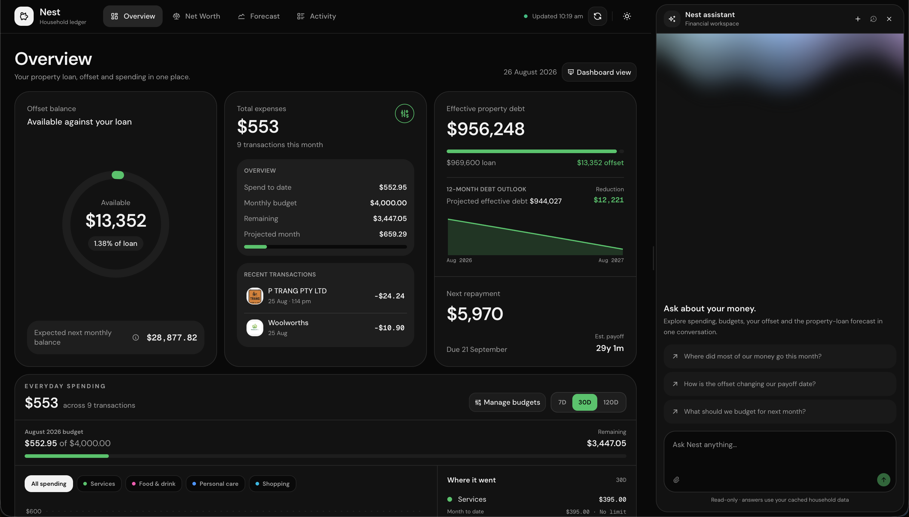
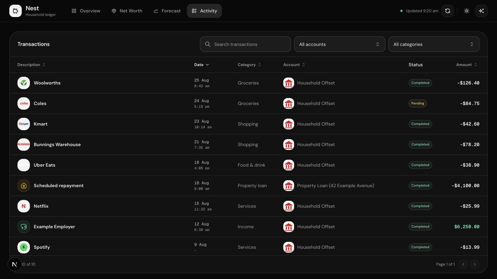
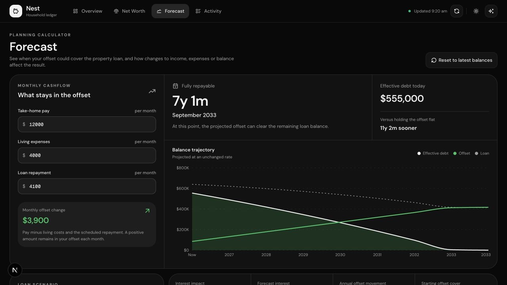
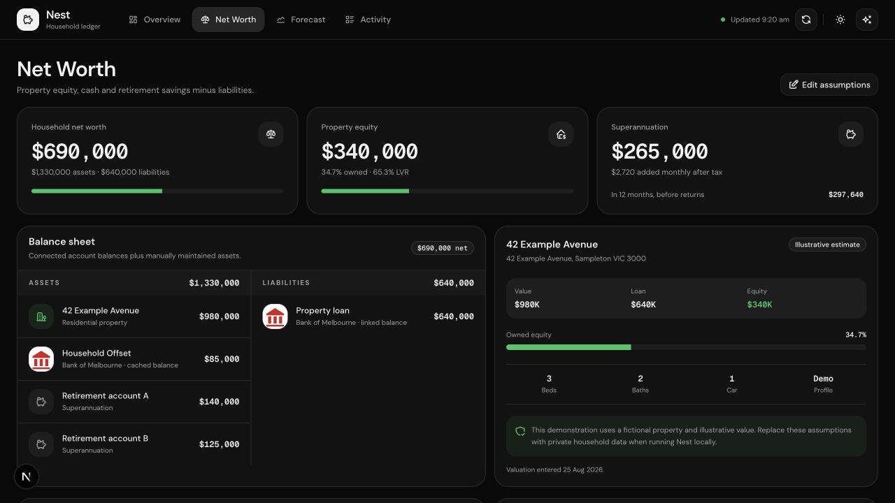

# Nest Spend Tracker

Nest is a local-first Australian household finance workspace for monitoring everyday spending, connected accounts, a property loan and offset, net worth, and long-term repayment forecasts. It also includes the Nest assistant, powered by Eve and OpenUI, for conversational analysis of cached household data.

## Platform


|                                                                                                                  |                                                                                                                      |
| ---------------------------------------------------------------------------------------------------------------- | -------------------------------------------------------------------------------------------------------------------- |
| **Overview**  | **Activity**  |
| **Forecast**  | **Net Worth**         |


> All screenshots use a fictional demonstration household. Names, addresses,
> accounts, transactions, balances, and forecasts shown here are illustrative.


## Features

- Connected account balances and cached transaction history
- Merchant and account logos, custom merchant names, and transaction details
- Monthly and category-level spending budgets persisted in SQLite
- Property-loan, offset, repayment, and interest forecasts
- Property equity, bank balances, superannuation, assets, and liabilities
- Searchable and filterable transaction activity table
- Eve-powered Nest assistant with reasoning, tool traces, Markdown, and OpenUI
- Light and dark colour themes with responsive desktop and mobile layouts


## Repository structure

Nest is a [pnpm workspace](https://pnpm.io/workspaces) with separate web and
agent applications:

```text
spend-tracker/
├── apps/
│   ├── agent/
│   │   └── agent/        # Eve instructions, tools, channels, and agent config
│   └── web/
│       ├── src/
│       │   ├── app/      # Next.js App Router pages, routes, and actions
│       │   ├── components/
│       │   ├── hooks/
│       │   └── lib/      # Redbark, database, forecasting, and finance logic
│       ├── drizzle/      # SQLite migrations
│       └── public/       # Static brand assets
├── data/                 # Shared local SQLite database; not committed
├── docs/screenshots/     # README screenshots
├── package.json          # Root workspace commands
└── pnpm-workspace.yaml
```

The Next.js application mounts the Eve runtime on the same origin through
`withEve`, so the browser can use `/eve/v1/*` without separate CORS or host
configuration.

## Prerequisites

- [Node.js](https://nodejs.org/) 24 or newer
- [pnpm](https://pnpm.io/) 10.30 or newer, preferably through Corepack
- A [Redbark](https://redbark.com/) API key with connected banking accounts
- A Vercel AI Gateway key if you want to use the Nest assistant


## Setup


### 1. Enable pnpm and install the workspace

From the repository root:

```bash
corepack enable
corepack prepare pnpm@10.30.0 --activate
pnpm install
```


### 2. Configure environment variables

Copy the committed template:

```bash
cp apps/web/.env.example apps/web/.env.local
```

Then fill in `apps/web/.env.local`:

```dotenv
REDBARK_API_KEY=rbk_live_your_key_here
REDBARK_API_VERSION=2026-10-01.wattle
AI_GATEWAY_API_KEY=vck_your_key_here
```

`REDBARK_API_KEY` supplies account and transaction data. See the
[Redbark API documentation](https://docs.redbark.com/api-reference/v2/overview)
for account connection and API details.

`AI_GATEWAY_API_KEY` is used by the Eve agent. You can run the finance
dashboard without chatting to Nest, but assistant responses require a valid
gateway credential.

### 3. Initialise the local database

Run the checked-in Drizzle migrations:

```bash
pnpm db:migrate
```

By default, Nest creates `data/spend-tracker.sqlite` at the workspace root.
Set `SPEND_TRACKER_DB_PATH` in `apps/web/.env.local` only if you need a custom
SQLite location.

### 4. Start the platform

```bash
pnpm dev
```

Open [http://localhost:3000](http://localhost:3000). The Next.js server starts
the Eve development runtime automatically and proxies its routes through the
same origin.

Use the refresh button in the header to fetch the latest connected-account
balances and transactions into the local database.

## Common commands


| Command            | Purpose                                                  |
| ------------------ | -------------------------------------------------------- |
| `pnpm dev`         | Start Next.js and Eve in development mode                |
| `pnpm build`       | Build the Eve runtime and production Next.js application |
| `pnpm start`       | Start the production Next.js server after a build        |
| `pnpm lint`        | Run ESLint for the web application                       |
| `pnpm typecheck`   | Type-check every workspace package                       |
| `pnpm db:generate` | Generate a Drizzle migration after schema changes        |
| `pnpm db:migrate`  | Apply pending SQLite migrations                          |
| `pnpm db:studio`   | Open Drizzle Studio for the local database               |
| `pnpm agent:info`  | Inspect Eve agent discovery and diagnostics              |
| `pnpm agent:build` | Build only the Eve agent                                 |


## Adding shadcn/ui components

Run shadcn from the web application so its aliases and `src` paths are used:

```bash
pnpm --dir apps/web exec shadcn add button
```

Components are written to `apps/web/src/components/ui` and imported through
the `@/components/ui/*` alias.

## Data and security

- `.env.local`, SQLite files, and generated database journals are ignored by
Git. Never commit live Redbark or AI Gateway credentials.
- Banking responses are synchronised into SQLite so normal page loads use the
local cache instead of repeatedly calling Redbark.
- The Nest assistant is read-only and is instructed to answer from cached
household data without mutating budgets, transactions, or accounts.
- Set `NEST_PUBLIC_DEMO=1` when capturing public screenshots to use the bundled
fictional household instead of connected banking or local database data.
- Review screenshot contents before publishing them; never capture the app with
real household data for public documentation.


## Production checks

Before deploying or opening a pull request, run:

```bash
pnpm lint
pnpm typecheck
pnpm build
```

